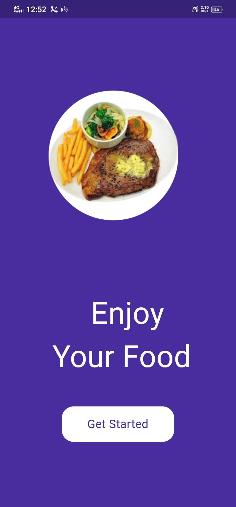
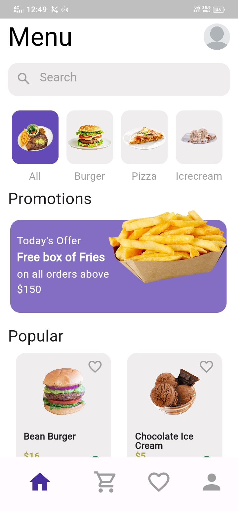
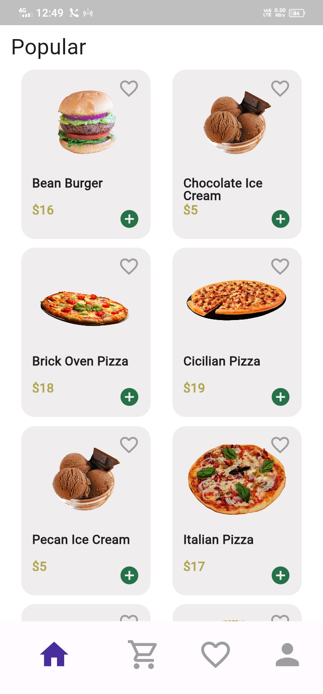
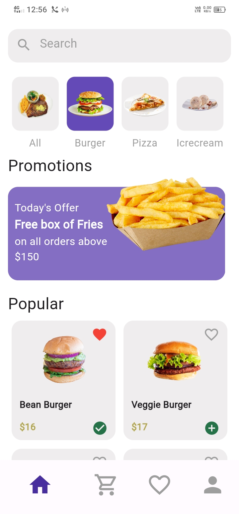
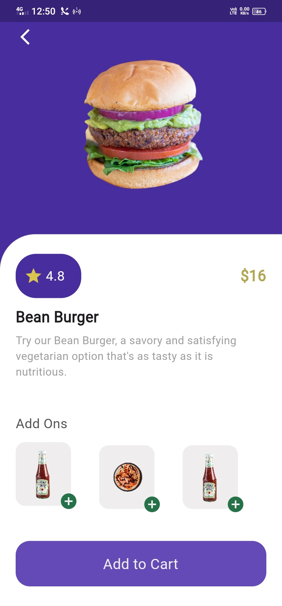
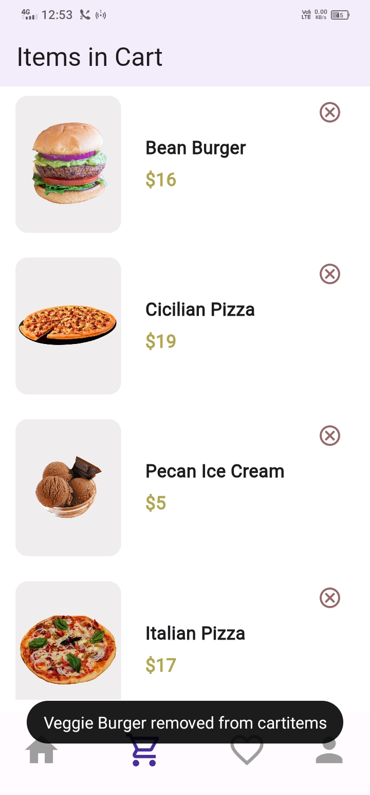
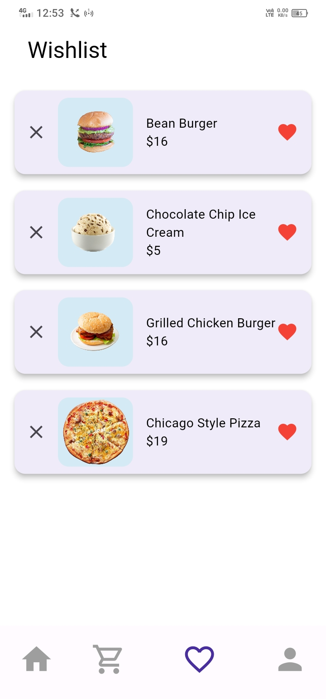
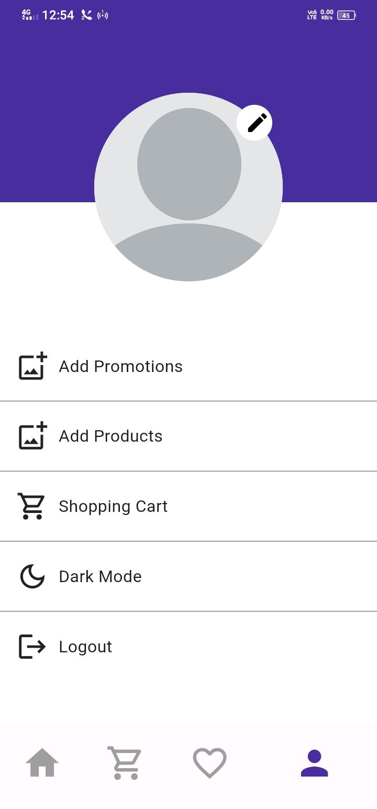

# 🍔Designer Digger 

Designer Digger Food Delivery App is a Flutter-based mobile application designed to simplify and enhance the food ordering experience. It caters to users who crave fast food, including items like ice cream, pizza, and burgers. This app provides a user-friendly interface with several essential functions to make the food ordering process seamless and enjoyable.

# Usage

Once you have the app up and running, you can:

Register and log in for a personalized experience.
Browse a mouthwatering menu of fast food items, including ice cream, pizza, and burgers.
Add your favorite items to the cart and proceed with the order.
Save frequently ordered items to your favorites for quick access.
Edit your profile to customize your experience and view your order history.

# 📧 Contact

If you have any questions or suggestions, please feel free to contact us at umar.aziz.dev@gmail.com

## 📷 Screenshots
| 1 | 2 | 3|
|------|-------|
||&nbsp;||&nbsp;||
| 4 | 5 | 6|
|------|-------|-------|
||&nbsp;||&nbsp;||
| 7 | 8|
|------|-------|-------|
||&nbsp;||

